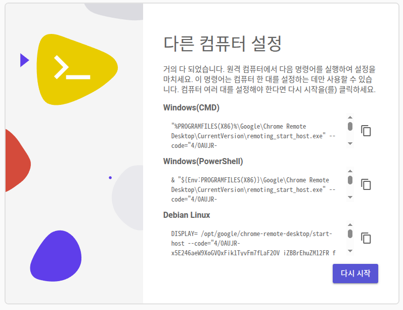
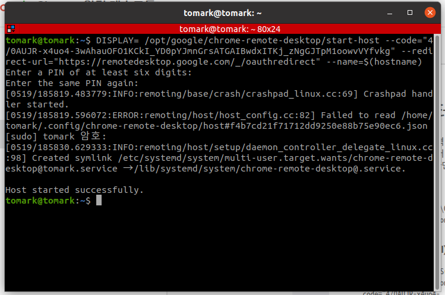

# multi-booting
Ubuntu &amp; Windows

## 우분투 $\to$ 윈도우
- 재시작 시, grub 부트로더가 우분투를 기본으로 select
- select index를 임의의로 설정하는 실행파일 작성

## 사용법
``` bash
# 실행 권한 부여, 한 번만 설정
sudo chmod +x Windows.sh

# 재시작
sudo ./Windows.sh
```
---
## NVIDIA Driver + CUDA 설치
- GPU: RTX 3050
``` bash
# NVIDIA Driver
sudo apt update
sudo apt install nvidia-driver-460

# CUDA
wget https://developer.download.nvidia.com/compute/cuda/11.2.0/local_installers/cuda_11.2.0_460.27.04_linux.run
sudo sh cuda_11.2.0_460.27.04_linux.run
```
## 개발 tool 설치
``` bash
# Terminator
sudo apt-get update
sudo apt-get install terminator -y

# VScode
sudo apt update
sudo apt install software-properties-common apt-transport-https wget
wget -q https://packages.microsoft.com/keys/microsoft.asc -O- | sudo apt-key add -
sudo add-apt-repository "deb [arch=amd64] https://packages.microsoft.com/repos/vscode stable main"
sudo apt install code
```

## ROS 설치
``` bash
sudo sh -c 'echo "deb http://packages.ros.org/ros/ubuntu $(lsb_release -sc) main" > /etc/apt/sources.list.d/ros-latest.list'
sudo apt install curl # if you haven't already installed curl
curl -s https://raw.githubusercontent.com/ros/rosdistro/master/ros.asc | sudo apt-key add -
sudo apt update
sudo apt install ros-noetic-desktop-full
source /opt/ros/noetic/setup.bash
echo "source /opt/ros/noetic/setup.bash" >> ~/.bashrc
source ~/.bashrc
sudo apt install python3-rosdep python3-rosinstall python3-rosinstall-generator python3-wstool build-essential
sudo apt install python3-rosdep
sudo rosdep init
rosdep update
```

## Chrome 원격 데스크톱
- 확장 프로그램 $\to$ Chrome remote Desktop

### App 설치
- SSH를 통해 설정 $\to$ 다음 $\to$ Debian Linux 링크 클릭
``` bash
sudo apt update
sudo apt --fix-broken install
sudo dpkg -i ~/Downloads/chrome-remote-desktop_current_amd64.deb
```

### 활성화
- 원격 데스크톱 앱 $\to$ 다음 $\to$ 승인 $\to$ 명령어 터미널에 복사 $\to$ 비밀번호 설정
<p style="display: flex; justify-content: space-around; align-items: center;">
  
  
</p>
